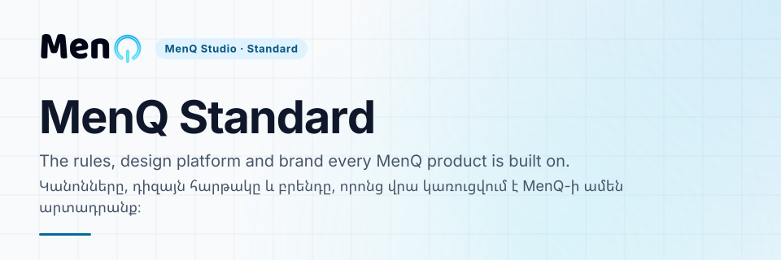

<!-- FRONT:START -->
<p align="center"><picture><source media="(max-width: 600px) and (prefers-color-scheme: dark)" srcset="docs/assets/front/cover-narrow-dark.svg"><source media="(max-width: 600px)" srcset="docs/assets/front/cover-narrow-light.svg"><source media="(prefers-color-scheme: dark)" srcset="docs/assets/front/cover-dark.svg"></picture></p>

<p align="center"><b>Start here</b> · [Project context](PROJECT_CONTEXT.md) · [Decisions](DECISION_INDEX.md) · [Design platform](platforms/design/README.md) · [Brand](platforms/design/brand-expression/README.md) · [Changelog](CHANGELOG.md)</p>

| | |
| :-- | :-- |
| **What it is** | The operating standard of the MenQ ecosystem: how we think, decide, design, build, validate and document |
| **Who it serves** | Every MenQ Studio product and the people and AI sessions that build them |
| **State** | Foundation v1 and the D-025 Design Platform are Locked; the D-027 brand layer is active (see Status below) |
| **Built with** | Markdown and JSON specifications, Python validators, GitHub Actions |

<details><summary><b>Հայերեն</b></summary>

| | |
| :-- | :-- |
| **Ինչ է** | MenQ էկոհամակարգի գործառնական ստանդարտը. ինչպես ենք մտածում, որոշում, նախագծում, կառուցում, ստուգում և փաստաթղթավորում |
| **Ում համար** | MenQ Studio-ի ամեն արտադրանքի և դրանք կառուցող մարդկանց ու AI session-ների |
| **Վիճակ** | Foundation v1-ը և D-025 Design Platform-ը Locked են. D-027 բրենդի շերտը գործում է (տես ներքևի Status-ը) |
| **Կառուցված է** | Markdown և JSON սպեցիֆիկացիաներ, Python ստուգիչներ, GitHub Actions |

</details>

<sub>MenQ Studio · Standard · repository front page standard v1</sub>
<!-- FRONT:END -->

# MenQ Standard

> **HY**  
> Մարդը միտք է բերում։  
> AI-ն օգնում է։  
> Մարդը որոշում է։  
> Ստանդարտը պահպանում է։

> **EN**  
> Humans bring ideas.  
> AI assists.  
> Humans decide.  
> Standards preserve.

## Status / Կարգավիճակ

**HY:** Ընթացիկ վիճակի միակ ամբողջական ցանկը․ context և handoff ֆայլերը հղվում են այստեղ։ Բաց հարցերը՝ [`NEXT_CHAT_HANDOFF.md`](NEXT_CHAT_HANDOFF.md)։  
**EN:** The one complete list of the current state; the context and handoff files point here. Open matters: [`NEXT_CHAT_HANDOFF.md`](NEXT_CHAT_HANDOFF.md).

- **Foundation v1:** Locked and GREEN / Locked և GREEN
- **D-024 Platforms Architecture v1:** Locked / Locked (2026-10-07)
- **Foundation v1.0.0 release:** [`foundation-v1.0.0`](https://github.com/menqstudio/MenQ-Standard/releases/tag/foundation-v1.0.0)
- **D-025 MenQ Design Platform Architecture v1:** Locked; in-repo consumers are M2 pilots, real-consumer obligation open / Locked. repo-ի ներսի consumer-ները M2 pilot են, իրական consumer-ի պարտավորությունը բաց է
- **D-027 MenQ Brand Expression Layer v1:** Approved — Implementing / Approved — Implementing
- **D-026 Canonical Session Read Law:** Locked; superseded in part by D-028. CI checks the Markdown inventory, not any session's read / Locked. մասամբ փոխարինված է D-028-ով։ CI-ը ստուգում է Markdown inventory-ն, ոչ թե որևէ session-ի ընթերցումը
- **D-028 Bounded Session Read Law:** Approved (approved; the Owner merged pull request #29 on 2026-10-09). A CI gate holds the session-read core to 120,000 bytes / Approved (հաստատված. Owner-ը merge է արել pull request #29-ը 2026-10-09-ին)։ CI gate-ը session-read core-ը պահում է 120,000 բայթի սահմանում
- **D-025 implementation merge:** `2682c99cdcbb058b66ab0cd4ee82d923e5c2a7cc`
- **D-025 closure merge:** `9a833339b1d707d6cd8a792e031dd8ca2857d556`
- **D-025 lock merge:** `261f85e5b20d726a0ab1f05da84a4dc45a248873`
- **D-025 validated lock head:** `8ba2e987ff6dab2c25fda18744c7376953d0108f`
- **D-025 lock date:** 2026-07-13
- **Owner:** MenQ
- **Languages:** Armenian + English

## Ecosystem / Էկոհամակարգ

```text
MenQ Ecosystem
├── MenQ Studio
│   ├── Company
│   ├── Services
│   └── Products
│
└── MenQ Standard
    ├── Foundation
    ├── Platforms
    ├── Operating Standards
    └── Extensions
```

## Purpose / Նպատակ

**HY:** MenQ Studio-ն ընկերությունն է։ MenQ Standard-ը MenQ ecosystem-ի operating standard-ն է՝ ինչպես ենք մտածում, որոշում, նախագծում, կառուցում, ստուգում, փաստաթղթավորում և պահպանում համակարգերը։

**EN:** MenQ Studio is the company. MenQ Standard is the operating standard of the MenQ ecosystem: how we think, decide, design, build, validate, document, and preserve systems.

## MenQ Design Platform status / MenQ Design Platform վիճակ

**HY:** D-025-ը Locked է․ Owner-ը lock-ը explicit հաստատել է 2026-07-13-ին, և transaction-ը փակված է։ Parts 1–16 architecture-ը, registry/schema/package implementation-ը և `0.1.0-next.0` preview-ն առկա են։ Repo-ի ներսի երկու consumer-ը M2 pilot են, իսկ իրական consumer-ի պարտավորությունը բաց է՝ առաջինը MenQ Webpage-ն է, երկրորդը ընտրում է Owner-ը ([ուղղման գրառում](platforms/design/D-025_EVIDENCE_CORRECTION_RECORD.md), 2026-10-07)։

**EN:** D-025 is Locked: the Owner explicitly approved lock on 2026-07-13, and the transaction is closed. The Parts 1–16 architecture, the registry/schema/package implementation and the `0.1.0-next.0` preview exist. The two in-repo consumers are M2 pilots, and the real-consumer obligation is open: MenQ Webpage is the first, and the Owner selects the second ([correction record](platforms/design/D-025_EVIDENCE_CORRECTION_RECORD.md), 2026-10-07).

## Mandatory AI session startup / AI session-ի պարտադիր մեկնարկ

**HY:** Յուրաքանչյուր նոր MenQ Standard AI session մինչև substantive աշխատանք սկսելը պարտավոր է active branch/ref-ում ամբողջությամբ կարդալ session-read core-ը՝ [`foundation/ai-collaboration/SESSION_READ_MANIFEST.json`](foundation/ai-collaboration/SESSION_READ_MANIFEST.json)-ի `core` ցանկը, նրա հերթականությամբ։ Որևէ directory-ում աշխատելուց առաջ session-ը կարդում է նաև այն ֆայլերը, որոնք manifest-ը նշում է այդ directory-ի area-ի համար։ Պարտադիր օրենքը՝ [`foundation/ai-collaboration/CANONICAL_SESSION_READ_LAW.md`](foundation/ai-collaboration/CANONICAL_SESSION_READ_LAW.md), որոշումները՝ [`D-026`](foundation/ai-collaboration/D-026-CANONICAL-SESSION-READ-LAW.md) և [`D-028`](foundation/ai-collaboration/D-028-BOUNDED-SESSION-READ-LAW.md) (հաստատված. Owner-ը merge է արել pull request #29-ը 2026-10-09-ին)։ Active PR-ի դեպքում նաև կարդացվում են metadata-ն, changed files-ը, diff-ը, review threads-ը և checks-ը։ `scripts/check_session_read_budget.py` gate-ը core-ը պահում է 120,000 բայթի սահմանում և ստուգում է manifest-ը․ ոչ մի ծրագիր չի ստուգում, որ session-ը որևէ բան կարդացել է։

**EN:** Before substantive work begins, every new MenQ Standard AI session must read in full, on the active branch or ref, the session-read core: the `core` list of [`foundation/ai-collaboration/SESSION_READ_MANIFEST.json`](foundation/ai-collaboration/SESSION_READ_MANIFEST.json), in its order. Before working in a directory, the session also reads the files the manifest lists for that directory's area. The mandatory law is [`foundation/ai-collaboration/CANONICAL_SESSION_READ_LAW.md`](foundation/ai-collaboration/CANONICAL_SESSION_READ_LAW.md), with decisions [`D-026`](foundation/ai-collaboration/D-026-CANONICAL-SESSION-READ-LAW.md) and [`D-028`](foundation/ai-collaboration/D-028-BOUNDED-SESSION-READ-LAW.md) (approved; the Owner merged pull request #29 on 2026-10-09). For an active PR, its metadata, changed files, diff, review threads, and checks are also required. The `scripts/check_session_read_budget.py` gate holds the core to 120,000 bytes and checks the manifest; no program checks that a session read anything.

## Canonical navigation / Canonical նավիգացիա

- [`PROJECT_CONTEXT.md`](PROJECT_CONTEXT.md) — stable project and AI context / կայուն project և AI context
- [`AI_WORKING_CONTEXT.md`](AI_WORKING_CONTEXT.md) — current working continuity / ընթացիկ աշխատանքային շարունակականություն
- [`COLLABORATION_STYLE.md`](COLLABORATION_STYLE.md) — communication mood and working style / հաղորդակցության տրամադրություն և աշխատանքային ոճ
- [`NEXT_CHAT_HANDOFF.md`](NEXT_CHAT_HANDOFF.md) — current continuation handoff / ընթացիկ շարունակության handoff
- [`DECISION_INDEX.md`](DECISION_INDEX.md) — active append-only decision registry / գործող append-only decision registry
- [`DECISIONS.md`](DECISIONS.md) — historical `D-001–D-021` registry / պատմական `D-001–D-021` registry
- [`ECOSYSTEM_ARCHITECTURE.md`](ECOSYSTEM_ARCHITECTURE.md) — ecosystem hierarchy and ownership / ecosystem-ի hierarchy և ownership
- [`platforms/design/decisions/D-027-MENQ-BRAND-EXPRESSION-LAYER-V1.md`](platforms/design/decisions/D-027-MENQ-BRAND-EXPRESSION-LAYER-V1.md) — D-027 brand expression layer / D-027 brand expression layer
- [`CHANGELOG.md`](CHANGELOG.md) — history / պատմություն
- [`ROADMAP.md`](ROADMAP.md) — future direction / ապագա ուղղություն
- [`foundation/README.md`](foundation/README.md) — Foundation index / Foundation-ի index
- [`platforms/design/PROJECT_CONTEXT.md`](platforms/design/PROJECT_CONTEXT.md) — Design Platform current state / Design Platform-ի ընթացիկ վիճակ
- [`platforms/design/D-025_POST_MERGE_CLOSURE_RECORD.md`](platforms/design/D-025_POST_MERGE_CLOSURE_RECORD.md) — closure evidence / closure-ի evidence
- [`platforms/design/D-025_LOCK_RECORD.md`](platforms/design/D-025_LOCK_RECORD.md) — lock evidence / lock-ի evidence
- [`platforms/design/D-025_FINAL_POST_LOCK_AUDIT.md`](platforms/design/D-025_FINAL_POST_LOCK_AUDIT.md) — final audit and transaction closure / վերջնական audit և transaction-ի փակում
- [`platforms/design/implementation/release/d-025-readiness-record.json`](platforms/design/implementation/release/d-025-readiness-record.json) — machine-readable lock evidence / մեքենայաընթեռնելի lock evidence
- [`foundation/documentation/CANONICAL_WRITE_INTEGRITY_LAW.md`](foundation/documentation/CANONICAL_WRITE_INTEGRITY_LAW.md) — mandatory write integrity law / պարտադիր write integrity law

## Canonical rule / Canonical կանոն

**HY:** Չատերը workshop են։ Հաստատված architecture-ը և որոշումները պարտադիր տեղափոխվում են canonical documentation։ Tool success-ը verification evidence չէ։ AI-ն չի կարող Owner approval հորինել, PR merge անել կամ decision lock անել առանց explicit human authority-ի։ Locked decision-ի փոփոխությունը պահանջում է governed change control։

**EN:** Conversations are the workshop. Approved architecture and decisions must be transferred into canonical documentation. Tool success is not verification evidence. AI may not invent Owner approval, merge a PR, or lock a decision without explicit human authority. Changes to a locked decision require governed change control.

<!-- END: MENQ_STANDARD_ROOT_README -->